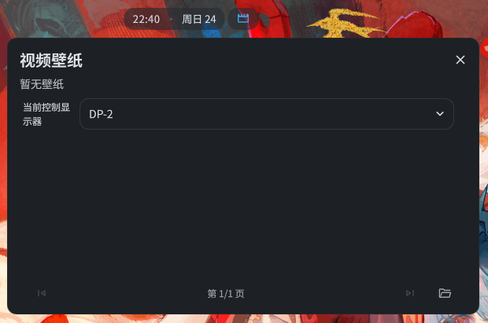

# MpvPaper Taskbar Widget

**Important Note: This is an extension widget. The [MpvPaper Plugin](https://github.com/tokisak1kurum1/mpvpaper-plugin) must be installed first for it to work.**

## Introduction
A taskbar control panel to quickly browse, select, and switch video wallpapers directly from the status bar.

## System Dependencies
**Required**: The core **MpvPaper Plugin** must be installed, and your system must have `mpvpaper` installed.
* Arch Linux: `sudo pacman -S mpvpaper`

## License
MIT